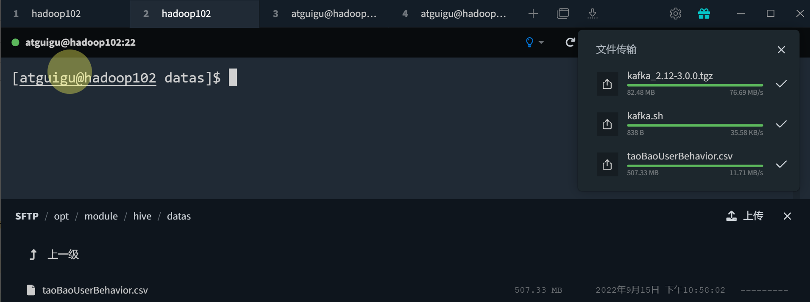
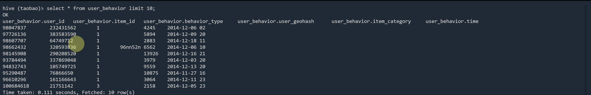

# 淘宝用户行为分析_day01_环境准备
## 1. 项目说明
&emsp;&emsp;① 项目目标：对用户行为数据进行分析，结果通过superset进行可视化展示  
&emsp;&emsp;② 项目架构：hadoop+hive+spark+mysql+superset  
&emsp;&emsp;③ 项目设施：三台本地虚拟机构建的集群，内存10G，8核

## 2. 数据准备
&emsp;&emsp;① 数据来源：淘宝用户行为数据 https://tianchi.aliyun.com/dataset/dataDetail?dataId=72423  
&emsp;&emsp;② 数据说明：本数据集约有104万条淘宝的用户行为数据，时间跨度2014年11月18日~2014年12月18日，共6个字段。   
&emsp;&emsp;③ 字段说明：  
&emsp;&emsp;&emsp;&emsp;· user_id：用户id，整数类型，序列化后的用户id，已脱敏  
&emsp;&emsp;&emsp;&emsp;· item_id：商品id，整数类型，序列化后的商品id，已脱敏  
&emsp;&emsp;&emsp;&emsp;· behavior_type：用户行为类型，字符串类型，分别用数字1，2，3，4来表示'pv','buy','cart','fav'  
&emsp;&emsp;&emsp;&emsp;· user_geohash：地理位置  
&emsp;&emsp;&emsp;&emsp;· item_category：商品品类id，商品所属的品类，整数类型  
&emsp;&emsp;&emsp;&emsp;· time：用户行为发生的时间，字符串类型  
&emsp;&emsp;④ 数据名称：修改为taoBaoUserBehavior.csv  
&emsp;&emsp;⑤ 查看数据：
```shell
PS C:\Users\NB70TK1\Downloads> type .\taoBaoUserBehavior.csv|Select -First 10
user_id,item_id,behavior_type,user_geohash,item_category,time
98047837,232431562,1,,4245,2014-12-06 02
97726136,383583590,1,,5894,2014-12-09 20
98607707,64749712,1,,2883,2014-12-18 11
98662432,320593836,1,96nn52n,6562,2014-12-06 10
98145908,290208520,1,,13926,2014-12-16 21
93784494,337869048,1,,3979,2014-12-03 20
94832743,105749725,1,,9559,2014-12-13 20
95290487,76866650,1,,10875,2014-11-27 16
96610296,161166643,1,,3064,2014-12-11 23
```
&emsp;&emsp;⑥ 将文件上传到本地虚拟机中

&emsp;&emsp;⑦ 使用命令去掉文件的第一行
```shell
sed -i "1d" taoBaoUserBehavior.csv
```
&emsp;&emsp;⑧ 查看文件前5行数据
```shell
[atguigu@hadoop102 datas]$ head taoBaoUserBehavior.csv -n 5
98047837,232431562,1,,4245,2014-12-06 02
97726136,383583590,1,,5894,2014-12-09 20
98607707,64749712,1,,2883,2014-12-18 11
98662432,320593836,1,96nn52n,6562,2014-12-06 10
98145908,290208520,1,,13926,2014-12-16 21
```
&emsp;&emsp;⑨ 将文件上传到hdfs的/taobao目录下  
```shell
[atguigu@hadoop102 datas]$ hadoop fs -mkdir /taobao
[atguigu@hadoop102 datas]$ hadoop fs -put taoBaoUserBehavior.csv /taobao
2022-09-15 23:06:08,121 INFO sasl.SaslDataTransferClient: SASL encryption trust check: localHostTrusted = false, remoteHostTrusted = false
2022-09-15 23:06:09,171 INFO sasl.SaslDataTransferClient: SASL encryption trust check: localHostTrusted = false, remoteHostTrusted = false
2022-09-15 23:06:10,031 INFO sasl.SaslDataTransferClient: SASL encryption trust check: localHostTrusted = false, remoteHostTrusted = false
2022-09-15 23:06:10,858 INFO sasl.SaslDataTransferClient: SASL encryption trust check: localHostTrusted = false, remoteHostTrusted = false
```
## 2. 在hive中创建表user_behavior，并导入数据
&emsp;&emsp;① 创建表user_behavior
```sql
create database taobao;
use taobao;
create external table user_behavior (
    user_id bigint comment "用户id",
    item_id bigint comment "商品id",
    behavior_type int comment "用户行为类型",
    user_geohash String comment "地理位置",
    item_category bigint comment "商品类别id",
    `time` String comment "时间"
)
row format delimited 
fields terminated by ",";
```
&emsp;&emsp;② 向表中导入数据
```sql
 load data inpath "/taobao" into table user_behavior;
```
&emsp;&emsp;③ 查看表中数据
```sql
select * from user_behavior limit 10;
```

**注意**：_表中的time字段所对应数据有问题，需要处理_。
