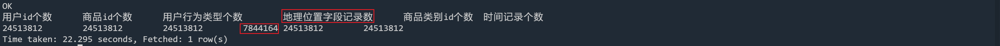
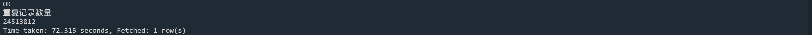
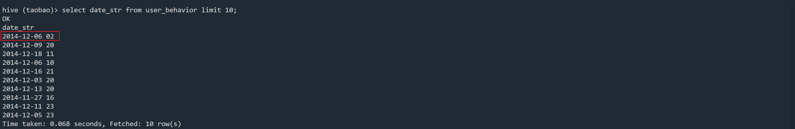

# 淘宝用户行为分析_day02_数据预处理
## 1. 查看数据基本情况
### 1. 查看表中字段缺失情况
① 统计各个字段的记录个数
```sql
select 
    count(user_id) as `用户id个数`,
    count(item_id) as `商品id个数`,
    count(behavior_type) as `用户行为类型个数`,
    count(user_geohash) as `地理位置字段记录数`,
    count(item_category) as `商品类别id个数`,
    count(date_str) as `时间记录个数`
from user_behavior;
```
**注意**: _hive中的count函数在参数是字段时，仅会统计非NULL值记录_

② 查看各个字段中NULL值个数
```sql
select 
    sum(if(user_id is NULL,1,0)) as `用户id的NULL个数`,
    sum(if(item_id is NULL,1,0)) as `商品id的NULL个数`,
    sum(if(behavior_type is NULL,1,0)) as `用户行为类型的NULL个数`,
    sum(if(user_geohash is NULL,1,0)) as `地理位置字段的NULL个数`,
    sum(if(item_category is NULL,1,0)) as `商品类别id的NULL个数`,
    sum(if(date_str is NULL,1,0)) as `时间的NULL个数`
from user_behavior;
```

### 2. 查看是否存在重复记录
```sql
select 
    sum(t1.num) as `重复记录数量`
from (
         select
             count(*) num
         from user_behavior
         group by user_id,item_id,behavior_type,user_geohash,item_category,date_str
         ) t1;
```

### 3. 查看表中字段date_str字段
```sql
select date_str from user_behavior limit 10;
```

表中date_str字段中包含年月日及小时信息，中间用空格间隔
## 2. 处理
① 创建新表user_behavior01
② 基于user_behavior表实现对数据的去重
③ 基于user_behavior表实现将date_str字段拆分为ymd和hour两个字段
④ 剔除掉字段user_geohash
```sql
create table user_behavior01 
    as select 
        user_id,
        item_id,
        behavior_type,
        item_category,
        split(date_str," ")[0] as ymd,
        split(date_str," ")[1] as hour
    from user_behavior
    group by user_id,item_id,behavior_type,user_geohash,item_category,date_str;
```

