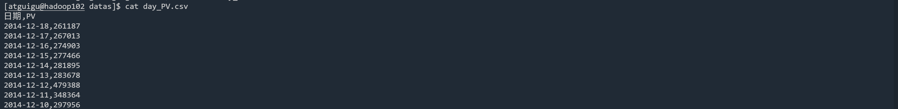
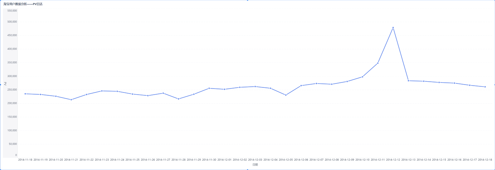
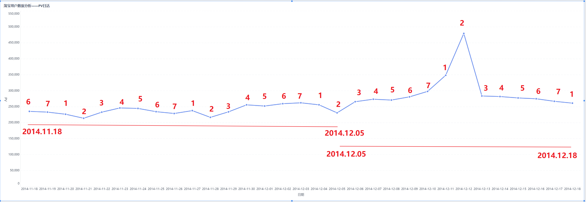

# 淘宝用户行为分析_day03_用户行为数据分析
## 1. pv和uv
① **PV**(访问量)：即Page View, 具体是指网站的是页面浏览量或者点击量，页面被刷新一次就计算一次。  
② **UV**(独立访客)：即Unique Visitor,访问您网站的一台电脑客户端为一个访客。  
## 2. 分析思路
从用户、商品、平台三个维度分析，解决如下问题：  
① 流量的数量和质量如何？  
② 付费用户的数量和比例如何？  
③ 用户活跃情况  
④ 那些用户是高价值用户，哪些用户是可以引导消费  
⑤ 用户活动时间规律  
⑥ 用户商品偏好
⑦ 商品成交量贡献情况  
⑧ 交易环节转化率、跳失率，流程及页面是否合理  
## 3. 分析
### 1. 用户分析
#### 1）用户数量、成交用户数量
① 统计用户数量
```sql
select
    count(distinct user_id) as `用户数量`
from user_behavior01;
```

② 统计成交用户数量
```sql
select
    count(distinct user_id) as `支付用户数量`
from user_behavior01 where behavior_type=4;
```

③ 计算成交用户占比
```sql
select
    concat(round((
              select
                  count(distinct user_id) as `支付用户数量`
              from user_behavior01 where behavior_type=4
          ) / (
              select
                  count(distinct user_id) as `用户数量`
              from user_behavior01
          ),4)*100,"%") as `成交用户占比`;
```

**总结**：用户数量为10000，成交用户数量为8886，成交用户占比为88.86%，即有大约有88%的用户进行了交易。  
#### 2）用户PV,UV,日活,成交转化率
> 日活：基于电商购物场景，我们将用户活跃定义为购买行为，所以日活就是每一天中有购买行为的用户数量
> 成交转化率：指一段时间所有到达店铺并产生购买行为的人数和所有到达店铺的人数的比率，即有购买行为人数/UV  

① 创建表day_PV统计每日PV  

```sql
create table day_PV as
select
    ymd as ymd,
    count(user_id) as PV
from user_behavior01
group by ymd
order by ymd ;    
```
导出表中数据到本地磁盘，格式要求将字段之间的分隔符为“,”  
```sql
insert overwrite local directory "/opt/module/hive/datas"
    row format delimited fields terminated by ","
select * from (
                  select cast(ymd as string) as ymd,cast(PV as string) as pv from day_PV
                  union
                  select "日期" as ymd ,"PV" as pv
                  ) t1
order by t1.ymd desc ;
```
得到数据如下：  

通过BI工具将数据可视化得到如下：  

**总结**：
PV数据整体趋势呈现周期性    
  
**在2014.11.18到2014.12.05期间（周期变化和星期几相关）**：  
&emsp;周1到周2，PV呈现下降趋势，周2达到最低点，大概率是开始新的一周的工作，购物欲望和需求逐渐减少；  
&emsp;周3到周4，PV呈现上升趋势，周4达到最高点，工作两天后，逐渐适应了，购物欲望和需求逐渐回升；  
&emsp;周4到周天,PV呈现在最高水平附近小范围波动，工作日没有几天了，临近周末的，购物欲望和需求持续旺盛。  
**在2014.12.06到2014.12.18期间（变化和日期相关）**：  
&emsp;2014.12.06到2014.12.12，PV呈现远超平均水平开始增涨，特别在12月10号到12月12号时，增长最快，12号到达峰值。  
&emsp;2014.12.12到2014.13，PV出现断崖式下跌，回到正常水平。  
&emsp;其原因是12月12号的”双12“活动的影响。  
   


